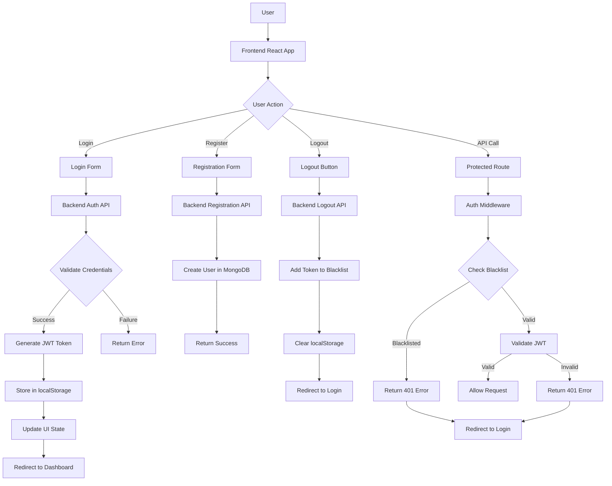
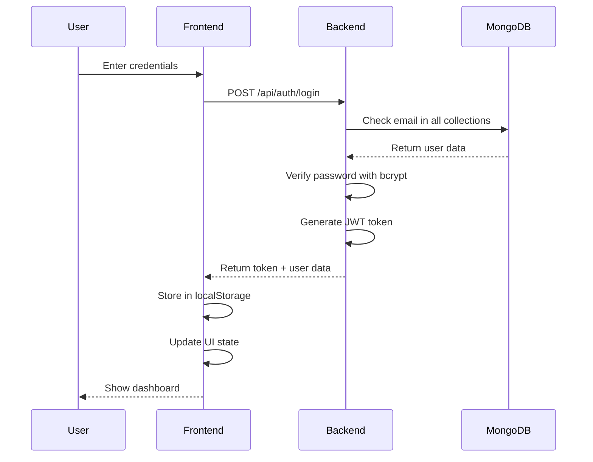
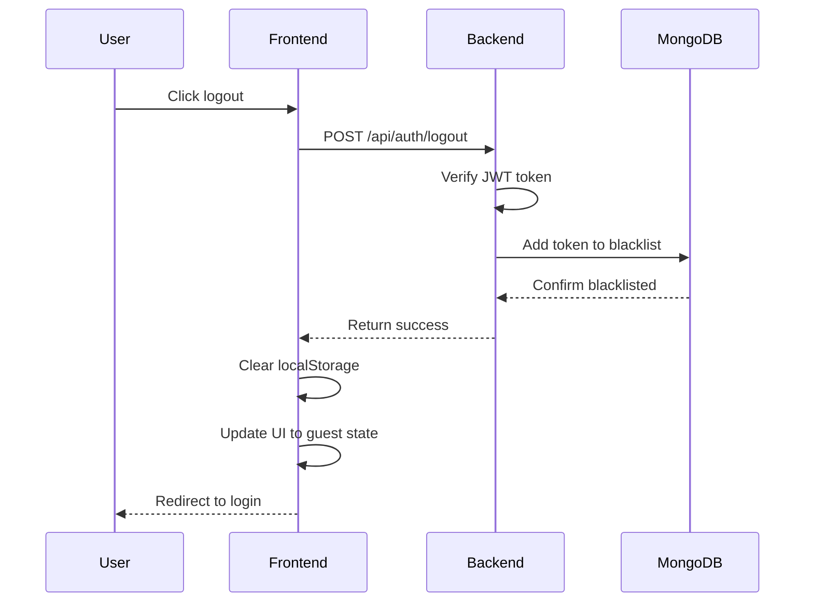
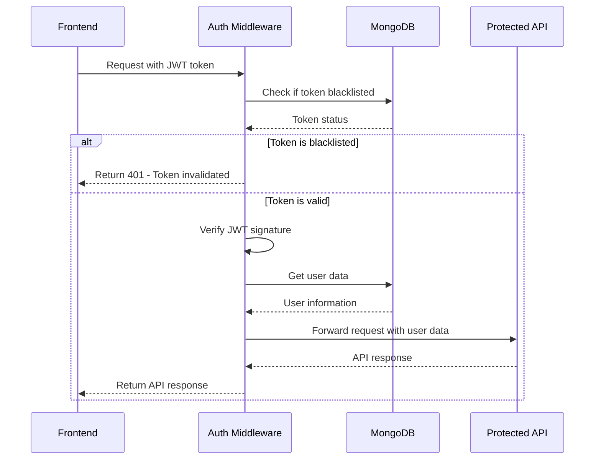
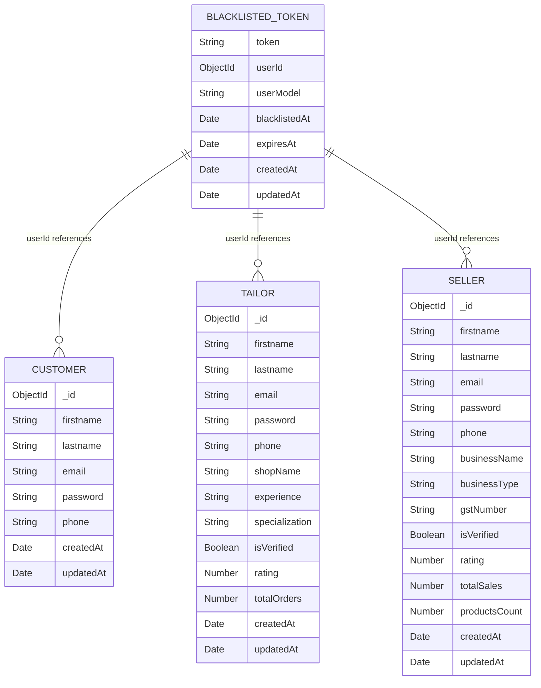
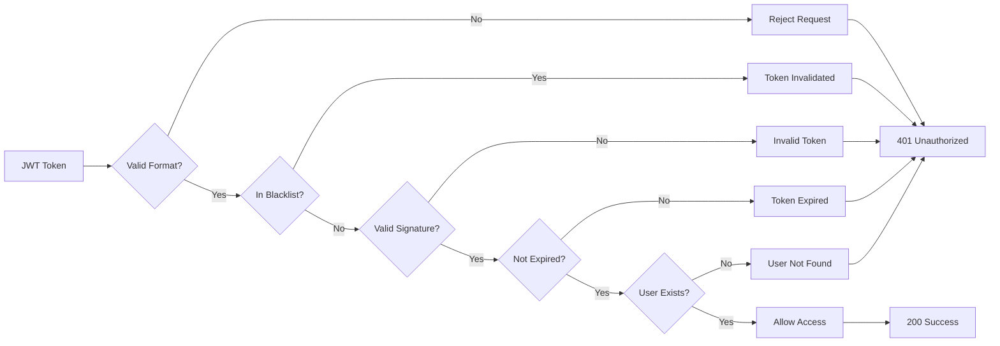
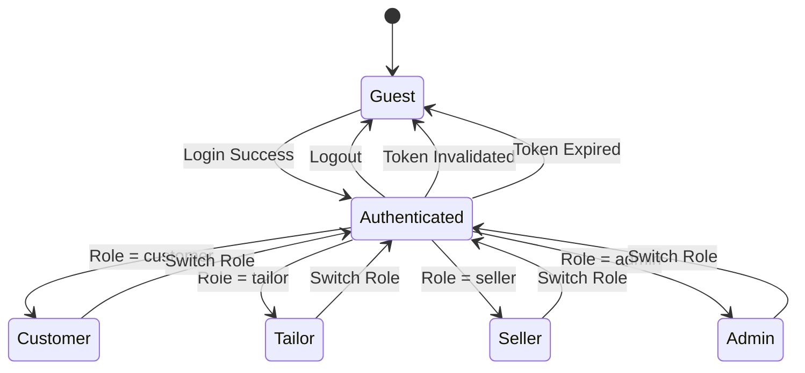
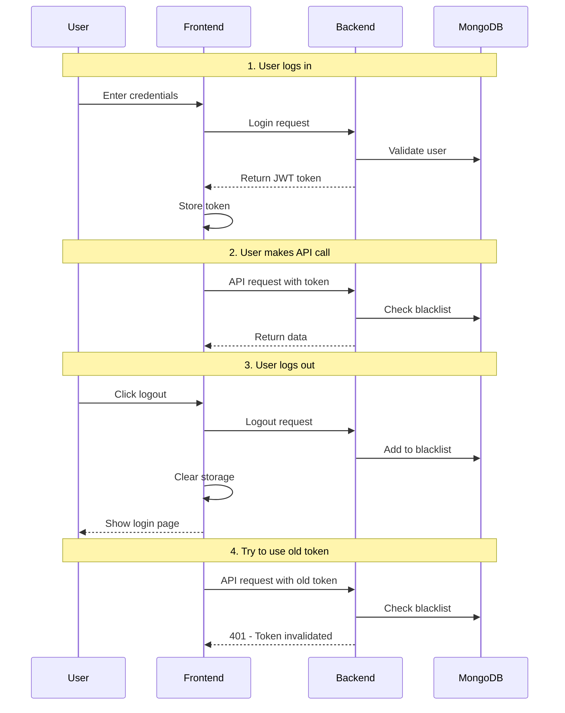
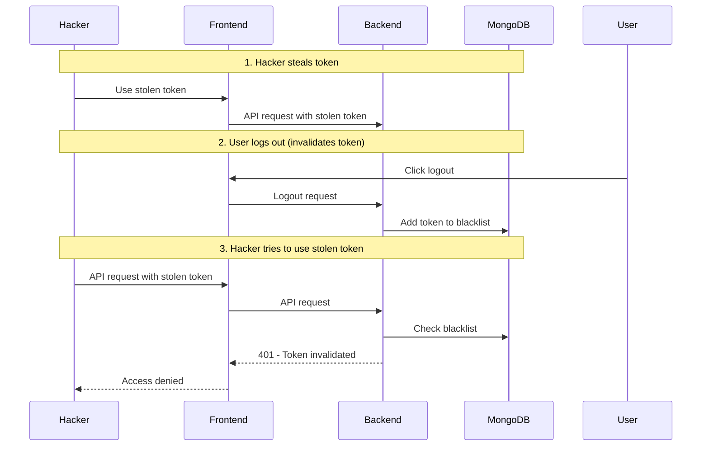

# 🔐 Authentication Workflow Diagrams

## 📊 Complete System Flow

## 🔄 Login Process

## 🚪 Logout Process

## 🛡️ API Request Protection

## 🗄️ Database Schema

## 🔐 Security Flow

## 📱 Frontend State Management

## 🧪 Testing Scenarios

### Scenario 1: Normal Login/Logout

### Scenario 2: Token Theft Protection

## 📊 Performance Metrics

### Database Queries
- **Login**: 1 query (find user by email)
- **Logout**: 1 query (insert blacklisted token)
- **API Request**: 2 queries (check blacklist + get user)
- **Token Validation**: 1 query (check blacklist)

### Response Times
- **Login**: ~100-200ms
- **Logout**: ~50-100ms
- **Protected API**: ~50-150ms
- **Token Validation**: ~20-50ms

### Storage Usage
- **JWT Token**: ~200-500 bytes
- **Blacklisted Token**: ~300-600 bytes
- **User Data**: ~1-2KB per user
- **Auto-cleanup**: Removes old tokens after 7 days

---

## 🎯 Key Benefits

1. **Immediate Security**: Tokens become unusable instantly on logout
2. **No Token Persistence**: Stolen tokens can't be used after logout
3. **Automatic Cleanup**: Old tokens removed automatically
4. **Role-Based Access**: Different permissions per user type
5. **Frontend Integration**: Real-time UI updates
6. **Production Ready**: Proper error handling and security measures 